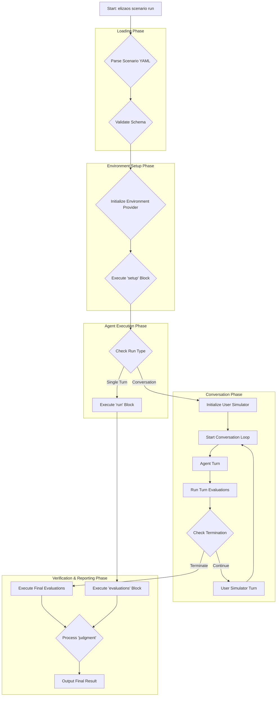

# ElizaOS Scenario Runner: Technical Specification

This document provides a detailed technical specification for the `elizaos scenario` command-line tool. It is intended for developers working on or extending the Scenario Runner's functionality.

For a high-level overview of the "why" behind this system, please see [`scenarios.md`](./scenarios.md).

---

## 1. CLI Command Architecture

The Scenario Runner is exposed through the main `elizaos` CLI application.

- **Command**: `elizaos scenario run [filePath]`
- **Arguments**:
  - `filePath`: The required path to the `.scenario.yaml` file to be executed.
- **Options**:
  - `--live`: (Boolean, default: `false`) When this flag is present, the runner will execute in "Live Mode," which ignores all `setup.mocks` and connects to real services.
  - `--env-file`: (String) Path to a custom `.env` file to load for the execution.

The command will be registered within the `packages/cli` using the `yargs` library, similar to other commands like `test` and `start`.

---

## 2. Execution Flow

The Scenario Runner follows a strict, sequential lifecycle to ensure repeatable and predictable test execution. For multi-turn conversation scenarios, the execution flow includes additional loops for turn-based evaluation and user simulation.



1.  **Parse YAML**: Read the file from disk and parse it using `js-yaml`.
2.  **Validate Schema**: The parsed object is validated against a set of TypeScript interfaces to ensure it is well-formed. Mismatches will cause an immediate exit with a clear error.
3.  **Initialize Environment Provider**: Based on the `environment.type` field (`local`), instantiate the corresponding provider.
4.  **Execute `setup` Block**: The runner sequentially processes the `setup` instructions:
    - **Mocks**: The Mocking Engine (see below) is configured.
    - **Virtual FS**: Files are written to the environment via the provider.
    - **Database Seeding**: The database adapter is called to execute seeding.
5.  **Execute `run` Block**:
    - **Single-turn scenarios**: The `run.input` is sent to the agent and waits for completion.
    - **Conversation scenarios**: Initialize the user simulator and begin the conversation loop.
6.  **Conversation Loop** (for conversation scenarios):
    - **Agent Turn**: Send current input to the agent and receive response.
    - **Turn Evaluations**: Execute any `turn_evaluations` defined in the conversation block.
    - **Termination Check**: Evaluate termination conditions to determine if conversation should continue.
    - **User Simulator Turn**: Generate next user response based on persona, objective, and conversation history.
7.  **Execute Evaluations**:
    - **Single-turn**: Execute items in the `evaluations` array.
    - **Conversation**: Execute `final_evaluations` from the conversation block, plus any traditional `evaluations`.
8.  **Process `judgment`**: The results of all evaluations are aggregated based on the `judgment.strategy`.
9.  **Output Result**: A summary of the run is printed to the console, including the final pass/fail status, conversation transcript (if applicable), and details on any failed evaluations. The process exits with code `0` for success and `1` for failure.

---

## 3. Environment Provider Interface

To abstract the execution context, the runner uses an `EnvironmentProvider` interface.

```typescript
// in packages/cli/src/scenarios/providers/types.ts

interface FileSystemOperation {
  type: 'write';
  path: string;
  content: string;
}

interface ExecutionResult {
  exitCode: number;
  stdout: string;
  stderr: string;
  files: Record<string, string>; // A map of file paths to their content after execution.
}

interface EnvironmentProvider {
  /**
   * Prepares the environment, including setting up the file system.
   */
  setup(fs: FileSystemOperation[]): Promise<void>;

  /**
   * Executes a command within the environment.
   */
  run(command: string): Promise<ExecutionResult>;

  /**
   * Cleans up any resources created during the run.
   */
  teardown(): Promise<void>;
}
```

- **`LocalEnvironmentProvider`**: Implements the interface using Node.js `child_process` for execution and `fs` for file operations on the host machine.

---

## 4. Mocking Engine Internals

The mocking engine's goal is to intercept calls to service methods without modifying the agent's source code. This will be achieved via monkey-patching the `AgentRuntime`.

The proposed mechanism is to add a method to the `AgentRuntime` itself:

```typescript
// in packages/core/src/runtime.ts
class AgentRuntime {
  // ... existing properties

  private mockRegistry: Map<string, Function> = new Map();

  public getService<T>(name: string): T {
    const serviceMethodKey = `${name}.${methodName}`; // e.g., "github-service.readFile"
    if (this.mockRegistry.has(serviceMethodKey)) {
      // Return a proxy that calls the mock function
    }
    // ... existing logic
  }

  public registerMock(serviceMethodKey: string, mockFunction: Function) {
    this.mockRegistry.set(serviceMethodKey, mockFunction);
  }
}
```

The Scenario Runner will call `runtime.registerMock()` for each item in the `setup.mocks` array before the `run` block is executed. This provides a clean, centralized way to inject test-specific behavior.

---

## 5. Conversation System

The Scenario Runner supports multi-turn conversation scenarios through a sophisticated conversation system that includes user simulation, turn-based evaluation, and intelligent termination conditions.

### 5.1 Conversation Configuration

```yaml
# Example conversation configuration in run block
run:
  - name: 'Customer Support Conversation'
    input: 'Hi, I need help with billing'

    conversation:
      max_turns: 6
      user_simulator:
        persona: 'polite customer with a billing question'
        objective: 'find out why charged twice this month'
        temperature: 0.6
        style: 'friendly and patient'
        constraints:
          - 'Be polite and cooperative'
          - 'Provide details when asked'

      termination_conditions:
        - type: 'user_expresses_satisfaction'
          keywords: ['thank you', 'resolved', 'perfect']
        - type: 'agent_provides_solution'
          keywords: ['follow these steps', 'issue resolved']

      turn_evaluations:
        - type: 'llm_judge'
          prompt: 'Did the agent respond helpfully?'
          expected: 'yes'

      final_evaluations:
        - type: 'llm_judge'
          prompt: 'Was the issue successfully resolved?'
          expected: 'yes'
          capabilities:
            - "Understood the customer's concern"
            - 'Provided helpful solutions'
```

### 5.2 User Simulator

The user simulator generates realistic user responses based on:

- **Persona**: Character description for the simulated user
- **Objective**: What the user is trying to accomplish
- **Temperature**: Creativity level for response generation (0.0-1.0)
- **Style**: Communication style guidelines
- **Constraints**: Rules the simulated user must follow

### 5.3 Termination Conditions

Conversations can terminate based on:

- **Keyword-based**: Detecting specific phrases indicating completion
- **Turn limit**: Maximum number of conversation turns
- **LLM evaluation**: AI-based assessment of conversation completion
- **Custom logic**: Extensible system for custom termination rules

### 5.4 Turn-based Evaluation

- **Turn Evaluations**: Run after each agent response
- **Final Evaluations**: Run at conversation completion
- **Conversation-specific evaluators**: Length checks, satisfaction metrics

---

## 6. Technical Implementation Details

### 6.1 Component Architecture

#### UserSimulator Class

```typescript
// Core user simulation with persona-driven response generation
export class UserSimulator {
  private runtime: AgentRuntime;
  private config: UserSimulatorConfig;

  constructor(runtime: AgentRuntime, config: UserSimulatorConfig);

  async generateResponse(
    conversationHistory: ConversationTurn[],
    latestAgentResponse: string,
    context: SimulationContext
  ): Promise<string>;

  private buildSimulationPrompt(
    history: ConversationTurn[],
    agentResponse: string,
    context: SimulationContext
  ): string;
}
```

#### ConversationManager Class

```typescript
// Orchestrates multi-turn conversation execution
export class ConversationManager {
  constructor(
    runtime: AgentRuntime,
    server: AgentServer,
    agentId: UUID,
    serverPort: number,
    trajectoryReconstructor: TrajectoryReconstructor
  );

  async executeConversation(
    initialInput: string,
    config: ConversationConfig
  ): Promise<ConversationResult>;

  private async executeTurn(
    userInput: string,
    turnNumber: number,
    config: ConversationConfig,
    previousTurns: ConversationTurn[]
  ): Promise<ConversationTurn>;

  private async checkTerminationConditions(
    turns: ConversationTurn[],
    conditions: TerminationCondition[]
  ): Promise<boolean>;
}
```

#### Type Definitions

```typescript
export interface UserSimulatorConfig {
  model_type: string;
  temperature: number;
  max_tokens: number;
  persona: string;
  objective: string;
  style?: string;
  constraints: string[];
  emotional_state?: string;
  knowledge_level: 'beginner' | 'intermediate' | 'expert';
}

export interface ConversationTurn {
  turnNumber: number;
  userInput: string;
  agentResponse: string;
  roomId: UUID;
  trajectory: TrajectoryStep[];
  duration: number;
  executionResult: ExecutionResult;
  turnEvaluations: EvaluationResult[];
}

export interface ConversationResult {
  turns: ConversationTurn[];
  totalDuration: number;
  terminatedEarly: boolean;
  terminationReason: string | null;
  finalEvaluations: EvaluationResult[];
  conversationTranscript: string;
  success: boolean;
}
```

### 6.2 Schema Extensions

#### Extended RunStepSchema

```typescript
const ConversationConfigSchema = z.object({
  max_turns: z.number().int().min(2).max(20),
  timeout_per_turn_ms: z.number().int().min(1000).optional().default(30000),
  total_timeout_ms: z.number().int().min(10000).optional().default(300000),

  user_simulator: z.object({
    model_type: z.string().optional().default('TEXT_LARGE'),
    temperature: z.number().min(0).max(2).optional().default(0.7),
    max_tokens: z.number().int().min(50).max(500).optional().default(200),
    persona: z.string(),
    objective: z.string(),
    style: z.string().optional(),
    constraints: z.array(z.string()).optional().default([]),
    emotional_state: z.string().optional(),
    knowledge_level: z
      .enum(['beginner', 'intermediate', 'expert'])
      .optional()
      .default('intermediate'),
  }),

  termination_conditions: z
    .array(
      z.object({
        type: z.enum([
          'max_turns_reached',
          'user_expresses_satisfaction',
          'agent_provides_solution',
          'conversation_stuck',
          'escalation_needed',
          'goal_achieved',
          'custom_condition',
        ]),
        description: z.string().optional(),
        keywords: z.array(z.string()).optional(),
        llm_judge: z
          .object({
            prompt: z.string(),
            threshold: z.number().min(0).max(1).optional().default(0.8),
          })
          .optional(),
      })
    )
    .optional()
    .default([]),

  turn_evaluations: z.array(EvaluationSchema).optional().default([]),
  final_evaluations: z.array(EvaluationSchema).optional().default([]),

  debug_options: z
    .object({
      log_user_simulation: z.boolean().optional().default(false),
      log_turn_decisions: z.boolean().optional().default(false),
      export_full_transcript: z.boolean().optional().default(true),
    })
    .optional()
    .default({}),
});

// Extended RunStepSchema (backward compatible)
const RunStepSchema = z.object({
  name: z.string().optional(),
  lang: z.string().optional(),
  code: z.string().optional(),
  input: z.string().optional(),
  evaluations: z.array(EvaluationSchema),

  // NEW: Optional conversation configuration
  conversation: ConversationConfigSchema.optional(),
});
```

### 6.3 Provider Integration

```typescript
// LocalEnvironmentProvider conversation support
export class LocalEnvironmentProvider implements EnvironmentProvider {
  private conversationManager?: ConversationManager;

  async run(scenario: Scenario): Promise<ExecutionResult[]> {
    const results: ExecutionResult[] = [];
    for (const step of scenario.run) {
      if (step.conversation) {
        // Initialize conversation manager if needed
        if (!this.conversationManager) {
          this.conversationManager = new ConversationManager(
            this.runtime!,
            this.server,
            this.agentId,
            this.serverPort,
            this.trajectoryReconstructor!
          );
        }

        const conversationResult = await this.conversationManager.executeConversation(
          step.input || '',
          step.conversation
        );

        // Convert conversation result to ExecutionResult format
        const executionResult: ExecutionResult = {
          exitCode: conversationResult.success ? 0 : 1,
          stdout: conversationResult.conversationTranscript,
          stderr: conversationResult.success ? '' : 'Conversation failed',
          files: await this.captureFileSystem(),
          startedAtMs: Date.now(),
          endedAtMs: Date.now(),
          durationMs: conversationResult.totalDuration,
          trajectory: conversationResult.turns.flatMap((turn) => turn.trajectory),
        };

        // Add conversation metadata
        (executionResult as any).conversationMetadata = {
          turnCount: conversationResult.turns.length,
          terminatedEarly: conversationResult.terminatedEarly,
          terminationReason: conversationResult.terminationReason,
          finalEvaluations: conversationResult.finalEvaluations,
        };

        results.push(executionResult);
      } else {
        // Existing single-turn logic unchanged
        // ... existing implementation
      }
    }
    return results;
  }
}
```

### 6.4 Configuration Schema Reference

#### Complete Scenario File Schema

```yaml
name: string                    # Required: Human-readable scenario name
description: string             # Required: Detailed description
plugins: PluginReference[]     # Optional: Plugin configurations
environment:                   # Required: Environment configuration
  type: "local"                  # Required: Environment type (only 'local' is supported)
setup:                         # Optional: Setup configuration
  mocks: Mock[]               # Optional: Mock definitions
  virtual_fs: Record<string, string>  # Optional: Virtual file system
run: RunStep[]                 # Required: Execution steps
judgment:                      # Required: Evaluation strategy
  strategy: "all_pass" | "any_pass"  # Required: Success criteria
```

#### Mock Configuration Schema

```yaml
mocks:
  - service: 'service_name' # Optional: Service identifier
    method: 'method_name' # Required: Method to mock
    when: # Optional: Condition matching
      args: [['exact', 'args']] # Exact argument matching
      input: # Input parameter matching
        param: 'value'
      context: # Request context matching
        user_id: '123'
      matcher: "args[0].includes('test')" # JavaScript matcher
      partialArgs: ['partial'] # Partial argument matching
    response: # Static response data
      data: { 'key': 'value' }
    responseFn: '() => ({ timestamp: Date.now() })' # Dynamic response function
    error: # Error simulation
      code: 'API_ERROR'
      message: 'Rate limit exceeded'
      status: 429
    metadata: # Response metadata
      delay: 1000 # Network delay simulation (ms)
      probability: 0.1 # Random failure rate (0-1)
```

#### Plugin Configuration Schema

```yaml
plugins:
  # Simple string reference
  - '@elizaos/plugin-bootstrap'

  # Full configuration object
  - name: '@elizaos/plugin-github'
    version: '1.0.0' # Optional: Specific version
    enabled: true # Optional: Enable/disable (default: true)
    config: # Optional: Plugin-specific config
      api_key: 'github_token'
      rate_limit: 100
```

#### LLM Judge Advanced Configuration

```yaml
- type: 'llm_judge'
  prompt: 'Comprehensive evaluation prompt'
  expected: 'yes'
  model_type: 'TEXT_LARGE' # Optional: LLM model type
  temperature: 0.1 # Optional: Temperature (0-2)
  json_schema: # Optional: Structured output
    type: 'object'
    properties:
      judgment:
        type: 'string'
        enum: ['yes', 'no']
      confidence:
        type: 'number'
        minimum: 0
        maximum: 1
      reasoning:
        type: 'string'
    required: ['judgment', 'confidence', 'reasoning']
  capabilities: # Optional: Capability checklist
    - 'Understands multi-step requests'
    - 'Provides accurate summaries'
    - 'Formats output clearly'
```

---

## 7. Performance & Resource Management

### 7.1 Resource Usage Optimization

**Memory Management:**

```typescript
// Conversation scenarios use more memory due to:
// - Multiple LLM calls per scenario
// - Conversation history storage
// - Enhanced trajectory data

const config = {
  max_turns: 8, // Reasonable limit
  timeout_per_turn_ms: 30000, // Prevent hanging
  user_simulator: {
    max_tokens: 200, // Limit response length
    temperature: 0.7, // Balance creativity/consistency
  },
};
```

**Token Efficiency:**

```typescript
// UserSimulator optimization
private buildSimulationPrompt(history, agentResponse, context): string {
  // Only include last 3 turns to limit token usage
  const recentHistory = history.slice(-3);

  // Compress older context
  const compressedContext = history.length > 3
    ? `Earlier conversation summary: ${this.summarizeEarlierTurns(history.slice(0, -3))}`
    : '';

  return `${compressedContext}\n\nRecent conversation:\n${recentHistory}...`;
}
```

### 7.2 Monitoring and Observability

```typescript
export interface ConversationMetrics {
  totalDuration: number;
  turnCount: number;
  avgTurnDuration: number;
  llmCallsPerTurn: number;
  tokenUsage: {
    total: number;
    userSimulation: number;
    agentResponses: number;
    evaluations: number;
  };
}
```

---

## 8. Evaluator Reference

Each evaluation is a class that implements a simple `Evaluator` interface.

```typescript
// in packages/cli/src/scenarios/evaluators/types.ts
interface EvaluationResult {
  success: boolean;
  message: string;
}

interface Evaluator {
  type: string;
  evaluate(params: any, result: ExecutionResult): Promise<EvaluationResult>;
}
```

**Core Evaluators:**

| Type                         | Description                                                                            | Parameters                                                                       |
| ---------------------------- | -------------------------------------------------------------------------------------- | -------------------------------------------------------------------------------- |
| `string_contains`            | Checks if the agent's final response contains a given substring.                       | `value`, `case_sensitive`                                                        |
| `regex_match`                | Checks if the agent's final response matches a regular expression.                     | `pattern`                                                                        |
| `file_exists`                | Checks if a file exists in the execution environment at a given path.                  | `path`                                                                           |
| `file_contains`              | Checks if a file's content contains a given substring.                                 | `path`, `value`                                                                  |
| `command_exit_code_is`       | Checks the exit code of a command run inside the environment.                          | `command`, `expected_code`                                                       |
| `trajectory_contains_action` | Checks the agent's internal event log to see if a specific action was executed.        | `action`                                                                         |
| `llm_judge`                  | Asks an LLM to judge the agent's response based on a given prompt and expected answer. | `prompt`, `expected`, `capabilities`, `json_schema`, `model_type`, `temperature` |
| `execution_time`             | Validates execution time against thresholds.                                           | `max_duration_ms`, `min_duration_ms`, `target_duration_ms`                       |

**Conversation-Specific Evaluators:**

| Type                  | Description                                                        | Parameters                                                       |
| --------------------- | ------------------------------------------------------------------ | ---------------------------------------------------------------- |
| `conversation_length` | Validates the conversation length against expected bounds.         | `min_turns`, `max_turns`, `optimal_turns`, `target_range`        |
| `conversation_flow`   | Detects and validates required conversation patterns.              | `required_patterns`, `flow_quality_threshold`                    |
| `user_satisfaction`   | Evaluates user satisfaction based on conversation analysis.        | `satisfaction_threshold`, `indicators`, `measurement_method`     |
| `context_retention`   | Tests agent's ability to retain context across conversation turns. | `test_memory_of`, `retention_turns`, `memory_accuracy_threshold` |

#### Conversation Flow Patterns

The `conversation_flow` evaluator can detect these patterns:

| Pattern                 | Description                                    |
| ----------------------- | ---------------------------------------------- |
| `question_then_answer`  | Agent asks question, user provides answer      |
| `problem_then_solution` | User states problem, agent provides solution   |
| `clarification_cycle`   | Multiple clarification exchanges               |
| `empathy_then_solution` | Agent shows empathy before providing solutions |
| `escalation_pattern`    | Appropriate escalation when needed             |

#### User Satisfaction Measurement Methods

The `user_satisfaction` evaluator supports multiple measurement approaches:

| Method               | Description                                         |
| -------------------- | --------------------------------------------------- |
| `keyword_analysis`   | Analyzes positive/negative keywords in conversation |
| `sentiment_analysis` | Uses LLM to analyze overall sentiment progression   |
| `llm_judge`          | Comprehensive LLM-based satisfaction assessment     |
