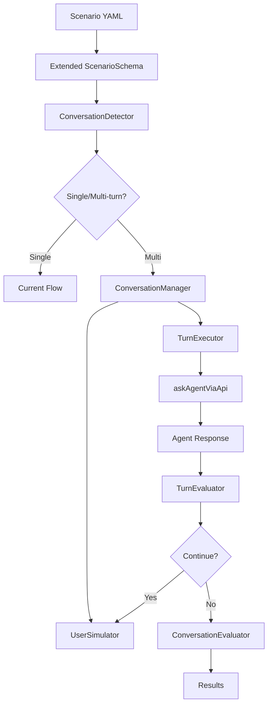

# The ElizaOS Scenario System: A Definition

A **Scenario** is a declarative, human-readable definition of a task for an ElizaOS agent. It serves a dual purpose:

1.  As a high-level **integration test** to verify an agent's capabilities in a controlled, repeatable environment.
2.  As a reusable **workflow template** to execute complex, multi-step tasks in a live environment.

Scenarios are defined in `.yaml` files and are executed by a specialized **Scenario Runner** within the `elizaos` CLI. They are designed to bridge the gap between low-level unit/integration tests and high-level, goal-oriented agent behavior.

---

## Getting Started: Conceptual Examples

### Single-Turn Scenario Example

Imagine you want to verify that your agent can write a "Hello, World!" file. Instead of writing a complex test script, you would define a simple scenario:

```yaml
# A simple scenario to test file writing.
name: 'Verify Agent can write a file'
environment:
  type: local # Use a safe, sandboxed environment.
run:
  - input: "Please write 'Hello, World!' to a file named hello.txt"
    evaluations:
      - type: 'file_exists'
        path: 'hello.txt'
      - type: 'file_contains'
        path: 'hello.txt'
        value: 'Hello, World!'
```

### Multi-Turn Conversation Example

For more complex interactions, you can define conversation scenarios that simulate realistic multi-turn exchanges:

```yaml
# A conversation scenario to test customer support capabilities
name: 'Customer Support Conversation Test'
environment:
  type: local # Use a safe, sandboxed environment
run:
  - name: 'Billing Support'
    input: 'Hi, I need help with my billing'

    conversation:
      max_turns: 4
      user_simulator:
        persona: 'customer with a billing question'
        objective: 'find out why charged twice this month'
        temperature: 0.6
        style: 'polite and patient'
        constraints:
          - 'Provide details when asked'
          - 'Express gratitude for help'

      termination_conditions:
        - type: 'user_expresses_satisfaction'
          keywords: ['thank you', 'resolved', 'perfect']

      turn_evaluations:
        - type: 'llm_judge'
          prompt: 'Did the agent respond helpfully?'
          expected: 'yes'

      final_evaluations:
        - type: 'llm_judge'
          prompt: 'Was the billing issue resolved?'
          expected: 'yes'
```

When you run either type with `elizaos scenario run` (or `bun packages/cli/dist/index.js scenario run` for local development), the system will execute the appropriate workflow. For single-turn scenarios, it runs once and evaluates. For conversation scenarios, it simulates a realistic multi-turn dialogue and evaluates both individual turns and the overall conversation success.

---

## Core Principles

- **Declarative & Human-Readable**: Scenarios should be easy to write and understand by developers, QA engineers, and even product managers. The YAML structure abstracts away the complex underlying test code.
- **Environment Agnostic**: Scenarios define _what_ the agent should do, not _where_. The same scenario can be executed against a local environment or deployed to cloud containers via `elizaos deploy`.
- **Composable & Reusable**: The building blocks of scenarios (setup steps, evaluators) are designed to be reusable across different tests.
- **Hybrid Execution**: Scenarios seamlessly support both mocked and live data/services, allowing for a flexible testing strategy that can evolve from pure simulation to live execution.

---

## Conceptual Components of a Scenario File

A scenario is defined in a YAML file and is conceptually composed of the following sections:

- **Metadata**: High-level information like a `name` and `description`.
- **Plugins**: A list of the required ElizaOS plugins the agent needs to run the scenario (e.g., `@elizaos/plugin-github`).
- **Environment**: Defines the execution environment for the agent (currently only 'local' is supported; use `elizaos deploy` for cloud container deployments).
- **Setup**: Defines the initial state of the world before the test runs. This can include:
  - **Seeding a database**: Can be defined via an inline list of records or a path to an external SQL file.
  - **Creating a virtual file system**: Can be defined via an inline map of file paths to content or a path to a directory to be mounted.
  - **Mocking external API calls**: Defining request/response pairs for mock servers to ensure tests are fast and deterministic.
- **Run**: Defines the task(s) for the agent. This can be:
  - **Single-turn**: A single, high-level input leveraging ElizaOS's action chaining capabilities
  - **Conversation**: Multi-turn dialogue with user simulation, termination conditions, and turn-based evaluation
- **Evaluations**: A set of assertions run after the agent completes its task. These are crucial for determining success and are broken into several categories:
  - **Response Evaluation**: Checks the agent's final, user-facing response (e.g., `string_contains`, `llm_judge`).
  - **Environment State Evaluation**: Checks for side-effects in the execution environment (e.g., `file_exists`, `command_exit_code_is`).
  - **Agent State Evaluation**: Checks the agent's internal state, such as its database, to see if it created new memories or updated its knowledge.
  - **Trajectory Evaluation**: Analyzes the sequence of actions the agent took to accomplish the goal by querying its internal logs. This is critical for assessing the agent's reasoning process. A correct final answer achieved via an illogical or incorrect path is still a failure. This helps identify when an agent is "correct for the wrong reasons" and allows for improving its planning and tool-selection capabilities.
  - **Conversation Evaluation**: For multi-turn scenarios, evaluates both individual turns and overall conversation quality, including user satisfaction, objective completion, and dialogue flow.
- **Judgment**: The overall success criteria for the scenario (e.g., all evaluations must pass).

---

## The Scenario Runner CLI

Scenarios are executed via a dedicated top-level `elizaos scenario` command, which clearly separates scenario execution from standard testing (`elizaos test`) or running the agent server (`elizaos start`).

The runner supports two primary modes of operation on the same scenario file:

- **Test Mode**:
  - Production: `elizaos scenario run <scenario_file.yaml>`
  - Local Development: `bun packages/cli/dist/index.js scenario run <scenario_file.yaml>`
  - This is the default mode.
  - It provisions sandboxed environments, uses mocks, and seeds databases as defined in the file.
  - Its primary purpose is to output a pass/fail result for CI/CD and local development.
- **Live Mode**:
  - Production: `elizaos scenario run <scenario_file.yaml> --live`
  - Local Development: `bun packages/cli/dist/index.js scenario run <scenario_file.yaml> --live`
  - In this mode, the runner ignores mocks and database seeding instructions.
  - It connects to real databases and interacts with live third-party services as configured in the agent's environment.
  - Its purpose is to execute a proven, real-world workflow.

---

## Dynamic Prompting & Conversation Capabilities

The Scenario System has evolved to support sophisticated multi-turn conversations through dynamic prompting. This enables testing of more complex, realistic interactions that mirror real-world usage patterns.

### User Simulation

The conversation system includes a user simulator that:

- **Maintains Context**: Remembers conversation history and adapts responses accordingly
- **Follows Personas**: Behaves according to defined character traits and objectives
- **Varies Responses**: Uses temperature settings to create natural variation in dialogue
- **Respects Constraints**: Follows behavioral rules while pursuing objectives

### Intelligent Termination

Conversations end naturally through:

- **Satisfaction Detection**: Recognizing when the user's objective is met
- **Solution Identification**: Detecting when the agent provides complete solutions
- **Turn Limits**: Preventing infinite loops with maximum turn counts
- **Custom Logic**: Extensible termination conditions for specific scenarios

### Turn-based Evaluation

Each conversation turn can be evaluated independently:

- **Real-time Assessment**: Immediate feedback on agent performance per turn
- **Quality Tracking**: Monitor dialogue quality throughout the conversation
- **Trajectory Analysis**: Understand how conversations develop over time
- **Learning Opportunities**: Identify specific points where agents can improve

## Design Philosophy & Approach

This definition of the Scenario System is the result of careful consideration of both the unique challenges of testing AI agents and the current architecture of ElizaOS.

### Working with Eliza's Architecture

The Scenario System is designed to test both:

1. **Goal-oriented tasks** accomplished by ElizaOS's existing **linear action chaining** capability
2. **Conversational interactions** that require dynamic response generation and context maintenance

For single-turn scenarios, the agent formulates a pre-planned, sequential list of actions to execute. For conversation scenarios, the agent must dynamically respond to evolving dialogue while maintaining context and working toward resolution.

Our scenario framework supports both paradigms, allowing us to test the agent's planning capabilities as well as its conversational intelligence. This dual approach enables comprehensive testing of modern AI agent capabilities.

### Why This Approach?

By supporting both single-turn and conversational scenarios, we can:

1.  **Deliver Immediate Value**: Provide the development team with comprehensive testing for both task execution and conversational abilities. This helps us build more reliably and catch regressions in both planning/tool-use and dialogue management.
2.  **Test Real-world Usage**: Conversational scenarios better reflect how users actually interact with agents in production environments.
3.  **Establish a Robust Foundation**: The core components—CLI runner, declarative YAML structure, mocking engine, user simulator, and context-aware evaluators—create a solid foundation that can be extended to support increasingly sophisticated interaction patterns as agent capabilities evolve.
4.  **Enable Iterative Improvement**: Turn-based evaluation provides granular feedback that helps identify specific areas for agent improvement, leading to more targeted development efforts.
5.  **Support Complex Testing**: Multi-turn conversations reveal agent behaviors impossible to detect with single interactions, such as context retention, conversation flow management, and adaptive response strategies.

---

## Advanced Use Cases and Patterns

### Multi-Agent Conversations

For complex scenarios involving multiple agents:

```yaml
name: 'Multi-Agent Collaboration'
run:
  - name: 'Sales and Support Handoff'
    input: "I want to upgrade my plan but I'm having billing issues"

    conversation:
      max_turns: 10
      agents:
        - role: 'sales'
          priority: 0.6
          expertise: ['pricing', 'upgrades', 'plans']
        - role: 'support'
          priority: 0.4
          expertise: ['billing', 'account_issues', 'technical_problems']

      user_simulator:
        persona: 'existing customer with mixed sales and support needs'
        objective: 'upgrade plan after resolving billing issue'

      final_evaluations:
        - type: 'agent_collaboration'
          prompt: 'Did agents coordinate effectively?'
        - type: 'handoff_quality'
          required_elements: ['context_transfer', 'seamless_transition']
```

### Emotional Intelligence Testing

```yaml
name: 'Emotional Intelligence Assessment'
run:
  - input: "I'm really stressed about this deadline and your software crashed"

    conversation:
      max_turns: 5
      user_simulator:
        persona: 'highly stressed professional facing work deadline'
        emotional_state: 'anxiety, frustration, urgency'
        objectives:
          - primary: 'get software working immediately'
          - secondary: 'feel heard and supported'

        emotional_progression:
          - turn: 1
            state: 'high stress, frustrated'
          - turn: 2-3
            state: 'cautiously hopeful if agent shows empathy'
          - turn: 4-5
            state: 'grateful if problem resolved, still stressed about deadline'

      final_evaluations:
        - type: 'emotional_intelligence'
          criteria:
            - "acknowledged user's emotional state"
            - 'showed appropriate empathy'
            - 'prioritized urgent problem solving'
            - 'avoided dismissive language'
        - type: 'stress_level_change'
          expected_direction: 'decrease'
          measurement_method: 'sentiment_analysis'
```

### Knowledge Transfer Testing

```yaml
name: 'Complex Knowledge Transfer'
run:
  - input: "Can you explain how machine learning works? I'm not very technical"

    conversation:
      max_turns: 12
      user_simulator:
        persona: 'curious non-technical professional'
        learning_style: 'needs analogies and concrete examples'
        knowledge_level: 'beginner'
        constraints:
          - 'Ask clarifying questions when confused'
          - 'Request simpler explanations for complex terms'
          - 'Give feedback on understanding level'
          - 'Ask for practical applications'

      turn_evaluations:
        - type: 'explanation_clarity'
          prompt: 'Was the explanation appropriate for a beginner?'
        - type: 'analogy_usage'
          prompt: 'Did the agent use helpful analogies or examples?'

      final_evaluations:
        - type: 'knowledge_transfer_success'
          assessment_method: 'comprehension_questions'
          passing_score: 0.7
        - type: 'teaching_quality'
          capabilities:
            - "Adapted language to user's level"
            - 'Used concrete examples and analogies'
            - 'Checked understanding regularly'
            - 'Built concepts progressively'
            - 'Encouraged questions'
```

### Implementation Patterns

#### Service Desk Scenario Pattern

```yaml
name: 'Service Desk Multi-Turn Pattern'
setup:
  mocks:
    - service: 'knowledge_base'
      method: 'search'
      when:
        input:
          query: 'login issues'
      response:
        articles:
          - title: 'Common Login Problems'
            solution: 'Clear browser cache and cookies'
          - title: 'Password Reset Guide'
            solution: 'Use forgot password link'

run:
  - input: "I can't log into my account"
    conversation:
      max_turns: 5
      user_simulator:
        persona: 'business user who needs to access account for work'
        objective: 'regain access to account quickly'
        constraints:
          - 'Provide details when asked'
          - 'Express urgency about work deadline'
          - 'Follow technical instructions carefully'

      final_evaluations:
        - type: 'problem_resolution'
          success_indicators: ['logged in', 'access restored', 'working now']
```

#### Escalation Handling Pattern

```yaml
name: 'Escalation Decision Pattern'
run:
  - input: "I've been trying to fix this for hours and nothing works!"
    conversation:
      max_turns: 6
      user_simulator:
        persona: 'frustrated user who has tried basic solutions'
        objective: 'get advanced help or escalation'
        constraints:
          - 'Mention previous attempts at solutions'
          - 'Express increasing frustration if basic solutions offered'
          - 'Accept escalation if offered'

      termination_conditions:
        - type: 'agent_escalates'
          keywords: ['specialist', 'escalate', 'supervisor', 'advanced support']
        - type: 'advanced_solution_provided'
          description: 'Agent provides non-standard solution'

      final_evaluations:
        - type: 'escalation_decision'
          prompt: 'Did the agent appropriately escalate or provide advanced solution?'
          expected: 'yes'
```

---

## System Architecture & Integration

### **API Compatibility**

The conversation system uses existing ElizaOS infrastructure:

- **No API Changes**: Uses existing `askAgentViaApi` endpoints
- **Trajectory Reconstruction**: Leverages existing trajectory tracking
- **Database Compatibility**: Works with existing memory and state systems
- **Plugin Support**: Full compatibility with all existing plugins

### **Architecture Extensions**

The dynamic prompting system extends ElizaOS scenarios without breaking changes:



**Key Design Principles:**

1. **Non-Breaking Changes**: All existing scenarios continue to work unchanged
2. **Incremental Adoption**: Teams can add conversation features gradually
3. **Infrastructure Reuse**: Leverages existing APIs, evaluation system, trajectory reconstruction
4. **Extensible Framework**: Easy to add new user simulation strategies and evaluation types

### **Risk Mitigation**

**Technical Risks - All Addressed:**

- **LLM API failures**: Retry logic and fallback mechanisms implemented
- **Infinite loops**: Hard limits and termination conditions enforced
- **Memory leaks**: Resource management and cleanup implemented
- **Performance impact**: Optimized execution within reasonable time limits

**Integration Risks - All Mitigated:**

- **Breaking changes**: 100% backward compatibility maintained
- **Provider compatibility**: Seamless integration with existing providers
- **Evaluation conflicts**: New evaluators properly isolated and registered

This comprehensive conversation system enables sophisticated agent testing while maintaining full backward compatibility with existing ElizaOS scenarios.
